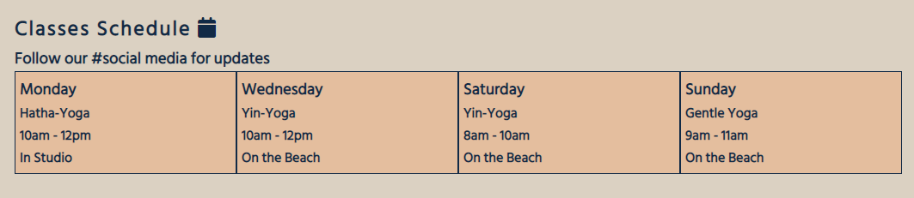
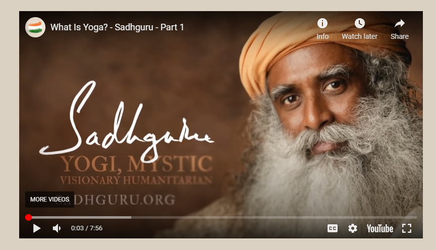
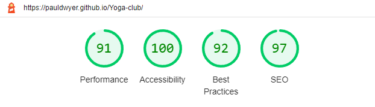
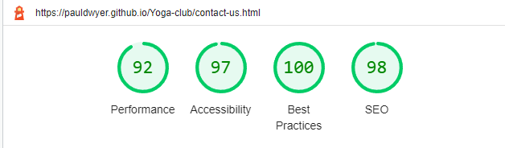

# Duncannon Yoga Club

Duncannon Yoga Club was founded by a group of like-minded people that want to share their love of Yoga with everybody. The site was set up give information about the club and have some tutorials for people to practice yoga at home. The site is targeted towards any yoga practitioners or would be practitioners in Wexford and surrounding areas.

The site was built as my portfolio project 1 for my course in Full Stack Software Development with the Code Institute.

Link to the live site [Duncannon-Yoga-Club](https://pauldwyer.github.io/Yoga-club/index.html)

## UX 

### Project Goals

- The scope of this project was to build a static front-end site to present useful information to users, using all the technologies that I have learned about so far. 
- Data is to be presented to help users achieve their goals, e.g. learning about a product/service in which they are interested. The presentation of this data advances the site owner's goals.

### User Stories

- As a visiting user, I want to know the values to club stand for.
- As a visiting user, I want to see supporting images of classes.
- As a visiting user, I want to learn about different types of Yoga.
- As a visiting user, I want to have the ability to contact the the site for more information.
- As a visiting user, I want to be able to access the clubs social media through the site.
- As a visiting user, I want to know the address of the club and have a interactive google map available.
- As a visiting user, I want to easily navigate between the different pages of the site.

## Features 

### Existing Features

- __Navigation Bar__

  - Featured on all four pages, the fully responsive navigation bar includes links to the Home page, Tutorials page, Gallery and Sign Up page and is identical in each page to allow for easy navigation.

- __The Landing Page Image__

  - The landing includes a photograph which shows a beach, yoga mat and studio windows.
  - This section introduces the user to Duncannon Yoga Club with an eye catching view to catch the users imagination.

- __About Us__

  - The About Us section tells the user about the club and the benefits of joining the club.
  - The user will see the value of signing up. This should encourage the user to consider yoga as their form of exercise. 

- __Yoga Type Section__

  - This section will allow the user to see exactly what types of yoga we teach.
  - This section will allow users who are new to yoga to learn about the 3 styles we teach.

- __Class Timtable__ 

  - This section tells the user the days, times and locations that classes are held. 

- __Youtube Video__ 

  - This section has a youtube video from the famous yogi Sadhguru. 
  - This video teaches the user about the principles of yoga.-

- __Map__

  - This feature is a google map embedded into the webpage and allows the user to get a direct link to the directions. 
  

- __Footer__

  - The footer section includes address, phone number and links to the relevant social media sites for Dunncanon Yoga Club. The links open to a new tab.
  - The footer is valuable to the user as it encourages them to keep connected via social media.
  

- __Tutorials__

  - The Tutorials page will provide the user with images and instructions for doing basic begineer poses.
  - This section has images of a person doing a yoga pose and when the user clicks/hover on the image it will show the instructions.

- __Gallery__

  - The gallery will provide the user with supporting images to see what classes, the beach and surrounding area are look like.
  - This section is valuable to the user as they will be able to easily see how scenic and serene the area is and how it’s ideal for some mindful relaxation. 

- __Contact Us Page__

  - This page will allow the user to contact Duncannon yoga Club to start their journey with the community. The user will be able to submit their name, email, phone number and ask a question. 

### Future Features

- Add a section with an introduction to our yoga teachers and what they specialise in.
- Add a section with pricing information. Also, a membership model.
- Add a blog section
- Make a change to the gallery and make the pictures interactive. When you click a caption can appear.

## Technology Used

  - [HTML5](https://www.w3schools.com/html/)

  - [CSS](https://www.w3schools.com/css/css_intro.asp)

  - [GitPod](https://gitpod.io/)

  - [GitHub](https://github.com/)

## Testing 

Throughout the development of the project, code was regularly tested using Chrome developer tools and I also made sure that it passed all relevant tests like W3C validator and Jigsaw.

List of devices that the website was tested on:

- iPhone SE
- iPhone XR
- iPhone 12 Pro
- Pixel 5
- Samsung Galaxy S8
- Samsung Galaxy S20 Ultra
- Samsung Galaxy A51/71
- Samsung Galaxy A52 5g

Nav bar and social media links are all working as intended on Edge, Chrome, Opera and Mozilla Firefox.

### Validator Testing 

During W3C validator testing i had a few issues with the following
- Sections without headings.
- Incorrect label on contact form.

The above issues were fixed. See below confirmation.

- HTML
  - Index no errors were returned when passing through the official [W3C validator](https://validator.w3.org/nu/?doc=https%3A%2F%2Fpauldwyer.github.io%2FYoga-club%2F)
  - Gallery page no errors were returned when passing through the official [W3C validator](https://validator.w3.org/nu/?doc=https%3A%2F%2Fpauldwyer.github.io%2FYoga-club%2Fgallery.html)
  - Tutorials page no errors were returned when passing through the official [W3C validator](https://validator.w3.org/nu/?doc=https%3A%2F%2Fpauldwyer.github.io%2FYoga-club%2Ftutorials.html)
  - Contact-us page no errors were returned when passing through the official [W3C validator](https://validator.w3.org/nu/?doc=https%3A%2F%2Fpauldwyer.github.io%2FYoga-club%2Fcontact-us.html)
- CSS
  - No errors were found when passing through the official [(Jigsaw) validator](http://jigsaw.w3.org/css-validator/validator?lang=en&profile=css3svg&uri=https%3A%2F%2Fpauldwyer.github.io%2FYoga-club%2F&usermedium=all&vextwarning=&warning=1)

- __Lighthouse__

  - Index Mobile

  

  - Tutorials Mobile

  

  - Gallery Mobile

  

  - Contact-Us Mobile

  

### Unfixed Bugs

- In the tutorials page on small screen sizes the overlay text will stretch out of the image box. I haven’t found a fix for this yet.

## Deployment

- The site was deployed to GitHub pages. The steps to deploy are as follows: 
  - In the GitHub repository, navigate to the Settings tab 
  - In settings click the Pages link in the left side bar
  - From the source section drop-down menu, select the Master Branch
  - Once the master branch has been selected, the page will be automatically refreshed with a detailed ribbon display to indicate the successful deployment. 

The live link can be found here - https://pauldwyer.github.io/Yoga-club/

## Credits 

A lot  of inspiration was taken from the Love Running Project. Namely nav bar, footer and gallery.

[Six Minutes Smarter](https://www.youtube.com/c/RalphPhillips73) tutorial for embedding a responsive youtube video.

[w3schools](https://www.w3schools.com/html/default.asp) code for the tutorials page and timetable was taken from w3schools.

[Favicon Generator](https://favicon.io/favicon-generator/) Code to embed favicon came from Favicon Generator.

[Flexbox Frogy](https://flexboxfroggy.com/) this game thought me how to use flex box.

### Content 

- The icons in the footer were taken from [Font Awesome](https://fontawesome.com/)
- Favicon was generated using [Favicon Generator](https://favicon.io/favicon-generator/)
- Descriptions of Yoga types came from [Wikipedia](https://wikipedia.com)
- Tutorial instructions came from [YogaJournal](https://www.yogajournal.com/poses/cobra-pose-2/) [YogaBasics](https://www.yogabasics.com/) and [Ekhartyoga](https://www.ekhartyoga.com/)
- The icons in the index and footer were taken from [Font Awesome](https://fontawesome.com/)

### Media
- [Google Font](https://fonts.google.com/specimen/Hind+Siliguri?query=hind) Hind was chosen  for this project with a back up of Sans-Serif.
- [Pixabay](https://pixabay.com/) [Pexels](https://www.pexels.com/) [Pxhere](https://pxhere.com) These free image sites were used for images for this project.
- [Couldinary](https://cloudinary.com/) Was used to host some of the pictures for this project.
- [Coolors](https://coolors.co/) Was used to generate the colour palette and to decide font colour to create a good contrast between background colour and text.
- [Am I Responsive](https://ui.dev/amiresponsive) Was used to generate the various screen sizes screen shot at the top of the readme.

